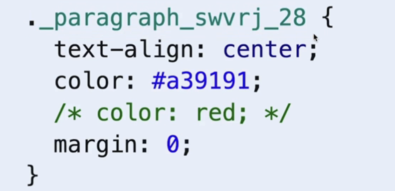

### 🥰 CSS

* Vite는 js에서 import한 css 파일을 연결하여 Dom에 동적으로 추가시켜준다.
> 각각의 jsx파일은 각자의 css를 가질 수 있으며, css를 import 하는것은 여러개여도 상관 없다.

---

#### 바닐라 css로 사용하는 방법
* 디자이너가 css를 작성한다면 import 후 id 혹은 className을 통해 css를입힐 수 있다.

* 장점
  * css를 직접 수정할 수 있다.
  * 스타일링을 작업하는 사람이 따로 있다면 그에 상관없이 컴포넌트 개발이 가능하다.
* 단점
  * css를 알아야 하거나, 디자이너가 추가로 필요하다.
  * 다른 컴포넌트 간 스타일 충돌 발생 가능성이 존재한다. (컴포넌트로 스코핑 되지 않는다.)
    * 만약 Header 컴포넌트에 Header.css를 적용한다고 가정한다.
    * 그 경우, Header이 아닌 Main 컴포넌트에서도 이 Header.css를 참조하게 된다.
    * 이는 css가 해당 Header 컴포넌트로 속하지 않는다는 뜻으로, 렌더링 된 페이지 전체에 위치하기 따문이다.

---

#### 인라인 스타일로 변경하기
* jsx코드에 직접적으로 스타일 적용
* 이 경우 주의점으로는 -를 사용할 수 없으므로 'text-align' 형식이나, camelCase로 textAlign 형식을 사용하여야 한다.

```javascript
<p style={{color:'red', textAlign:'left'}}>TEST</p>
```

* 장점
  * 쉽게 추가가 가능하다.
  * 다른 컴포넌트 엘리먼트에 적용되지 않는다.
  * 동적인 스타일링이 비교적 간단해진다.
    ```javascript
     className={`label ${emailNotValid ? 'invalid' : ''}`}
    ```
* 단점
  * 모든 요소를 개별적으로 적용해주어야 한다.
  * css코드와 jsx코드의 구분이 모호해지므로, 개발자 디자이너 간 협업이 어려워진다.

---

#### CSS 모듈을 이용하여 css 스코프하기
* css 파일에 .module을 붙이게 되면 이는 css module이 되며, 이를 통해 스코핑을 할 수 있다.
* 사용방식은 다음과 같다.

1. Header.css -> Header.module.css
2. 호출하는 jsx 파일에서 다음과 같이 수정
```javascript
/* before */
import './Header.css'

/* after */
import classes from './Header.module.css';


/* before */
<p className="test">TEST</p>

/* after */
<p className={classes.test}></p>
```

* 빌드 시 해당 모듈의 클래스 명은 새로운 임의의 클래스 이름으로 변경된다.

* 이를 통해 해당 컴포넌트에 고유한 클래스를 적용할 수 있다.
* 장점
  * css 형식을 따르기 떄문에 디자이너, 개발자 간의 충돌이 발생하지 않는다.
* 단점
  * css를 알아야하며, 바닐라 css를 사용하여야 한다.
  * 상대적으로 많은 css파일을 관리해야 한다.
